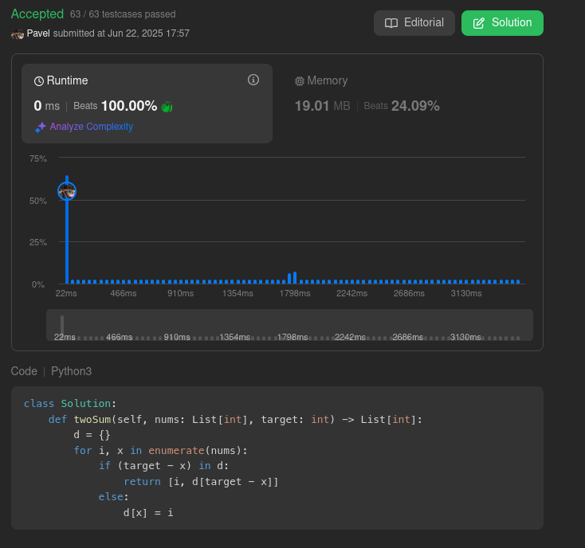

<!-- <style>

.hard{
    color: rgb(255 55 95)
}

.medium{
    color: rgb(255 192 30)
}

.easy{
    color: rgb(0 184 163)
}

.accepted{
    color: rgb(44 187 93)
}

.error{
    color:rgb(239 71 67)
}

</style> -->

<h2><a href=https://leetcode.com/problems/two-sum/description/>1.TwoSum</a><h2>

<ul>
<li><p>Problem Difficulty: $\color[RGB]{0,184,163}{\textrm{Easy}}$</p></li>
<li><p>Status: $\color[RGB]{44, 187, 93}{\textrm{Accepted}}$</strong></p>
</ul>

<h2>Problem Condition</h2>

<div><p>Given an array of integers <code>nums</code>&nbsp;and an integer <code>target</code>, return <em>indices of the two numbers such that they add up to <code>target</code></em>.</p>

<p>You may assume that each input would have <strong><em>exactly</em> one solution</strong>, and you may not use the <em>same</em> element twice.</p>

<p>You can return the answer in any order.</p>

<p>&nbsp;</p>
<p><strong>Example 1:</strong></p>

<pre><strong>Input:</strong> nums = [2,7,11,15], target = 9
<strong>Output:</strong> [0,1]
<strong>Explanation:</strong> Because nums[0] + nums[1] == 9, we return [0, 1].
</pre>

<p><strong>Example 2:</strong></p>

<pre><strong>Input:</strong> nums = [3,2,4], target = 6
<strong>Output:</strong> [1,2]
</pre>

<p><strong>Example 3:</strong></p>

<pre><strong>Input:</strong> nums = [3,3], target = 6
<strong>Output:</strong> [0,1]
</pre>

<p>&nbsp;</p>
<p><strong>Constraints:</strong></p>

<ul>
	<li><code>2 &lt;= nums.length &lt;= 10<sup>4</sup></code></li>
	<li><code>-10<sup>9</sup> &lt;= nums[i] &lt;= 10<sup>9</sup></code></li>
	<li><code>-10<sup>9</sup> &lt;= target &lt;= 10<sup>9</sup></code></li>
	<li><strong>Only one valid answer exists.</strong></li>
</ul>

<p>&nbsp;</p>
<strong>Follow-up:&nbsp;</strong>Can you come up with an algorithm that is less than <code>O(n<sup>2</sup>)</code><font face="monospace">&nbsp;</font>time complexity?</div>

<p>&nbsp;</p>
<h2>Solution Intuition</h2>
<p>Lets save in the hashmap element of the array and index of this element in array as value. So if target - current element exists then we we found a pair and we can return it.</p>

<p>&nbsp;</p>
<h2>Solution Code</h2>

```python
from typing import List

class Solution:
    def twoSum(self, nums: List[int], target: int) -> List[int]:
        d = {}
        for i, x in enumerate(nums):
            if (target - x) in d:
                return [i, d[x]]
            else:
                d[x] = i
```

<p>&nbsp;</p>
<h2>Solution Picture</h2>

