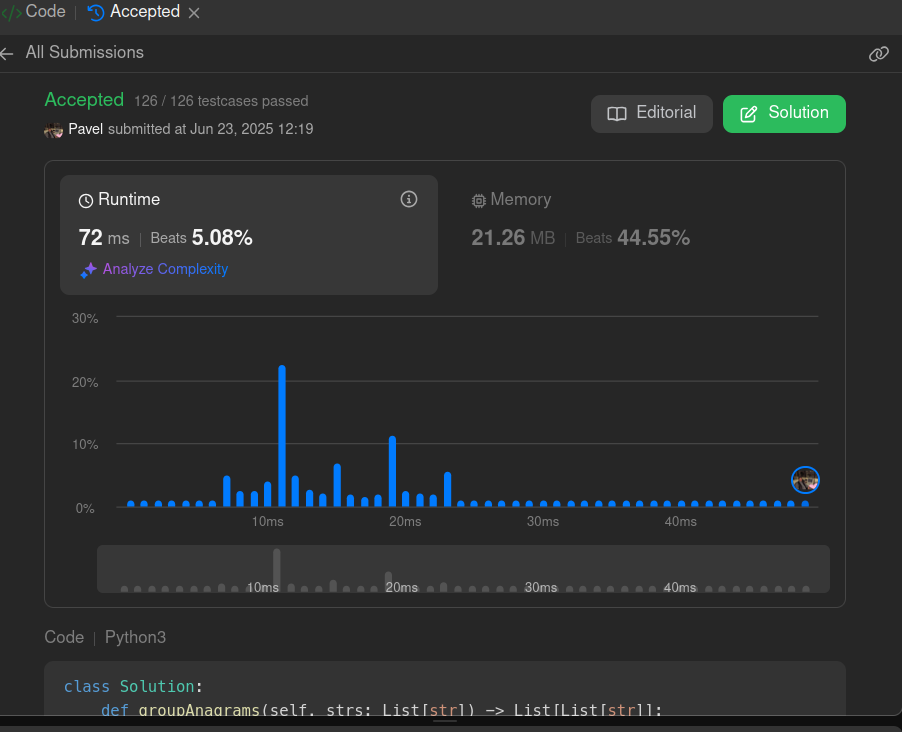

<!-- <style>

.hard{
    color: rgb(255 55 95)
}

.medium{
    color: rgb(255 192 30)
}

.easy{
    color: rgb(0 184 163)
}

.accepted{
    color: rgb(44 187 93)
}

.error{
    color:rgb(239 71 67)
}

</style> -->

<h2><a href=https://leetcode.com/problems/group-anagrams/description/>49.GroupAnagrams</a><h2>

<ul>
<li><p>Problem Difficulty: $\color[RGB]{255,192, 30}{\textrm{Medium}}$</p></li>
<li><p>Status: $\color[RGB]{44, 187, 93}{\textrm{Accepted}}$</strong></p>
</ul>

<h2>Problem Condition</h2>
<div class="elfjS" data-track-load="description_content"><p>Given an array of strings <code>strs</code>, group the <a href="../../../dictionary.md#anagram">anagram</a> together. You can return the answer in <strong>any order</strong>.</p>

<p>&nbsp;</p>
<p><strong class="example">Example 1:</strong></p>

<div class="example-block">
<p><strong>Input:</strong> <span class="example-io">strs = ["eat","tea","tan","ate","nat","bat"]</span></p>

<p><strong>Output:</strong> <span class="example-io">[["bat"],["nat","tan"],["ate","eat","tea"]]</span></p>

<p><strong>Explanation:</strong></p>

<ul>
	<li>There is no string in strs that can be rearranged to form <code>"bat"</code>.</li>
	<li>The strings <code>"nat"</code> and <code>"tan"</code> are anagrams as they can be rearranged to form each other.</li>
	<li>The strings <code>"ate"</code>, <code>"eat"</code>, and <code>"tea"</code> are anagrams as they can be rearranged to form each other.</li>
</ul>
</div>

<p><strong class="example">Example 2:</strong></p>

<div class="example-block">
<p><strong>Input:</strong> <span class="example-io">strs = [""]</span></p>

<p><strong>Output:</strong> <span class="example-io">[[""]]</span></p>
</div>

<p><strong class="example">Example 3:</strong></p>

<div class="example-block">
<p><strong>Input:</strong> <span class="example-io">strs = ["a"]</span></p>

<p><strong>Output:</strong> <span class="example-io">[["a"]]</span></p>
</div>

<p>&nbsp;</p>
<p><strong>Constraints:</strong></p>

<ul>
	<li><code>1 &lt;= strs.length &lt;= 10<sup>4</sup></code></li>
	<li><code>0 &lt;= strs[i].length &lt;= 100</code></li>
	<li><code>strs[i]</code> consists of lowercase English letters.</li>
</ul>
</div>

<p>&nbsp;</p>
<h2>Solution Intuition</h2>
<p>To solve this problem let's compare two ways.

1. We are sorting all string and using them to push to dictionary as a key. In this approach we will have time O(N*Klog(K)) complexity because of sort.  
2. We can create 26 size dictionary which will have all letters and their count in each str. So we will iterate through all strs and count for each char. When we counted all chars we will create a str of all english letters which will be used as a key for bucket dictionary. So by this approach we will have O(N*K) time complexity.
</p>

<p>&nbsp;</p>
<h2>Solution Code</h2>

```python
class Solution:
    def groupAnagrams(self, strs: List[str]) -> List[List[str]]:
        letters_dictionary = {'a': 0,
        'b':0,
        'c':0,
        'd':0,
        'e':0,
        'f':0,
        'g':0,
        'h':0,
        'i':0,
        'j':0,
        'k':0,
        'l':0,
        'm':0,
        'n':0,'o':0, 'p':0, 'r':0, 's':0, 't':0, 'u':0, 'v':0, 'w':0, 'x':0, 'y':0, 'z':0, 'q':0}
        buckets = defaultdict(list)
        for x in strs:
            d = letters_dictionary.copy()
            for c in x:
                d[c] += 1
            key = ""
            for c in d:
                key += f"{c}{d[c]}#"        
            buckets[key].append(x)
        return list(buckets.values())
        
```

<p>&nbsp;</p>
<h2>Solution Picture</h2>
