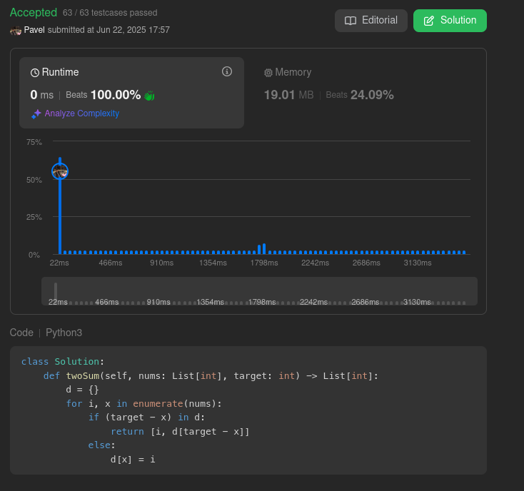

# Leetcode solutions with explanations

##   [217.ContainsDuplicate](Algorithms/Leetcode/217ContainsDuplicate/README.md) 

##   [242.ValidAnagram](Algorithms/Leetcode/242ValidAnagram/README.md) 

##   [1.TwoSum](Algorithms/Leetcode/1TwoSum/README.md) 

##   [49.GroupAnagrams](Algorithms/Leetcode/49GroupAnagrams/README.md) 

